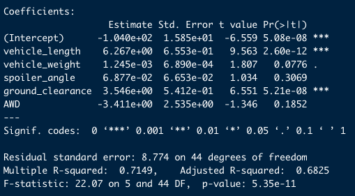
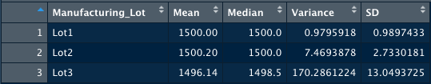
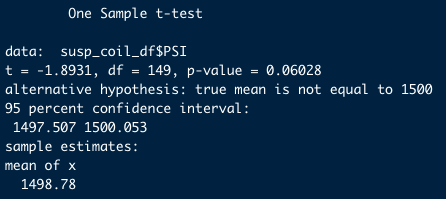
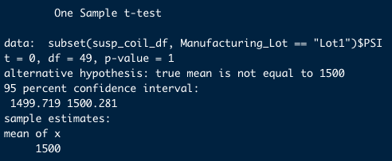
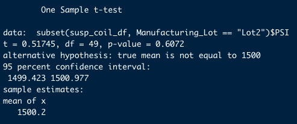
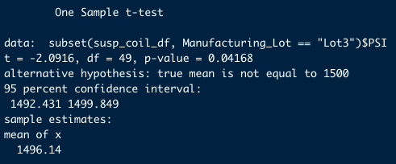

# MechaCar Statistical Analysis

## Summary

AutosRUs' newest prototype, the MechaCar, is suffering from production troubles that are blocking the manufacturing team's progress. AutosRUs' upper management has requested a review of the production data for insights that may help the manufacturing team.

This review involves the following:
- Performing multiple linear regression analysis to identify which variables in the dataset predict the mpg of MechaCar prototypes
- Collecting summary statistics on the pounds per square inch (PSI) of the suspension coils from the manufacturing lots
- Running t-tests to determine if the manufacturing lots are statistically different from the mean population
- Designing a statistical study to compare vehicle performance of the MechaCar vehicles against vehicles from other manufacturers. For each statistical analysis, you'll write a summary interpretation of the findings.

## Multiple Linear Regression Analysis to Predict Miles Per Gallon

After performing a multiple linear regression on the Miles Per Gallon variables (Vehicle Length, Vehicle Length, Spoiler Angle, Ground Clearance, AWD), it is clear that the Vehicle Length and Ground Clearance variables do have an affect on Miles Per Gallon and provide a non-random amount of variance, since their P-values were lower than 0.05. See below.

The slope of the linear model is not considered to be zero, since the P-value was lower than 0.05 and thus significant.

This multiple linear model does effectively predict Miles Per Gallon of MechaCar prototypes, because the R-squared value is strong, at 0.7149, and the P-value was significantly lower than 0.05 on two of the variables (Vehicle Length and Ground Clearance).

## Suspension Coils Analysis

The design specifications for the MechaCar suspension coils dictate that the variance of the suspension coils must not exceed 100 pounds per square inch. 

### All Coils
Across all lots, the suspension coils appear to meet design specifications for Variance, because at a little above 62 PSI, they are below the 100 PSI variance threshold. See below.

### Coils by Lot
As the data is broken down by lot, it's clear that not all lots meet design specifications on Variance. Lots 1 and 2 fall well within the specs, but lot 3 is significantly above the 100 PSI variance threshold, at a little above 170 PSI. See below.

## T-Tests on Suspension Coils

T-tests were run to determine if:
1. The mean PSI in all of the manufacturing lots were statistically different from the mean 1,500 PSI in the overall population.
2. The mean PSI in each of the manufacturing lots (samples) were statistically different from the mean 1,500 PSI in the overall population.

### T-Test For All Lots
Based on the T-Test run for all lots, it can be determined that based on a P-value of 0.06028, which is higher than 0.05, we can't confidently say that the sample mean is different than the population mean of 1,500 PSI.

### T-Test For Lot 1
Based on the T-Test run for Lot 1, it can be determined that based on a P-value of 1, which is higher than 0.05, we can't confidently say that the sample mean is different than the population mean of 1,500 PSI. See below.

### T-Test For Lot 2
Based on the T-Test run for Lot 2, it can be determined that based on a P-value of 0.6072, which is higher than 0.05, we can't confidently say that the sample mean is different than the population mean of 1,500 PSI. See below.

### T-Test For Lot 3
Based on the T-Test run for Lot 3, it can be determined that based on a P-value of 0.04168, which is lower than 0.05, we can confidently say that the sample mean is different than the population mean of 1,500 PSI. See below.

## Study Design: MechaCar vs Competition

Since purchasing a vehicle is a big decision for a consumer, it is beneficial for them to understand if there are is any correlation between different features or factors in the vehicle they're considering. One study that could help them in their decision making is the correlation between the overall cost of a vehicle and the annual cost to maintain the vehicle. For example, buying a competitor vehicle would mean higher annual maintenance costs than for a MechaCar.

It would be beneficial for MechaCar to run a statistical study showing how maintenance costs of their vehicles are lower than competitors, compared to overall cost.

The null hypothesis (H0) would be that maintenance costs of their vehicles are lower than competitors, compared to overall cost. The alternative hypothesis (Ha) would be that maintenance costs of their vehicles are not lower than competitors, compared to overall cost.

A T-test would be run to show consumers why it is beneficial to buy a MechaCar instead of a competitor vehicle, to show that annual maintenance costs for a MechaCar would be lower than competitors, and that consumers would save money over the length of their ownership.

The data that would be needed: 
- Overall costs of a MechaCar
- Overall costs of competitor vehicles
- Maintenance costs of a MechaCar vehicle
- Maintenance costs of competitor vehicles

